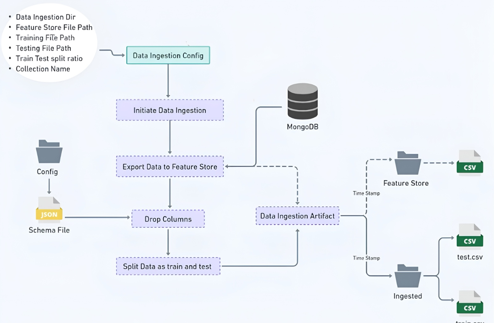

# **Network Security MLOps Project: Phishing URL Detection Pipeline**

## **Project Overview**

### **Objective of the Project**

The primary goal of this project is to create an automated pipeline for detecting phishing websites. Using a **machine learning model**, the system evaluates various features of URLs and determines whether the website is legitimate or a phishing attempt. Phishing attacks, which are designed to deceive users into entering sensitive information, are a growing concern in cybersecurity. This system can automatically flag phishing websites based on the features of the URL, enabling enhanced web security measures.

The project follows a **Machine Learning Operations (MLOps)** methodology to automate and streamline the process of data handling, model training, evaluation, and deployment.

The project leverages the following pipeline:

- **Data Ingestion**: Fetching raw data from a MongoDB database.
- **Data Validation**: Checking the correctness, integrity, and potential data drift in the dataset.
- **Data Transformation**: Transforming and preprocessing data for training, including handling missing values and scaling.
- **Model Training**: Training machine learning models to classify URLs as phishing or legitimate.
- **Deployment**: Deploying the model in a production environment using AWS services.

This approach ensures that the entire machine learning lifecycle is automated, from data collection to model inference.

---

### **Dataset**

The dataset used contains features derived from various URLs and websites. These features help determine whether a given URL is a phishing site. Below is a detailed description of the dataset’s columns:

#### **Dataset Columns**

- **having_IP_Address**: Indicates whether the URL contains an IP address.
- **URL_Length**: The length of the URL.
- **Shortening_Service**: Whether a URL shortening service is used.
- **having_At_Symbol**: Whether the URL contains the "@" symbol.
- **double_slash_redirecting**: Whether the URL has double slashes indicating redirection.
- **Prefix_Suffix**: Whether the URL has any prefix or suffix.
- **having_Sub_Domain**: Presence of subdomains.
- **SSLfinal_State**: Indicates if SSL is used on the website.
- **Domain_registration_length**: The length of the domain registration.
- **Favicon**: Presence of a favicon in the URL.
- **port**: The port number in the URL.
- **HTTPS_token**: Whether HTTPS is used in the URL.
- **Request_URL**: Whether the URL contains a request.
- **URL_of_Anchor**: Whether the URL is used in an anchor tag.
- **Links_in_tags**: Number of links within HTML tags.
- **SFH**: Indicates whether the URL form action is on the same server.
- **Submitting_to_email**: Indicates whether the form submits to an email.
- **Abnormal_URL**: Whether the URL is considered abnormal.
- **Redirect**: Whether the URL redirects to another domain.
- **on_mouseover**: Presence of mouseover events in the URL.
- **RightClick**: Whether right-clicking is disabled on the page.
- **popUpWidnow**: Presence of pop-up windows.
- **Iframe**: Whether the website uses an iframe.
- **age_of_domain**: The age of the domain.
- **DNSRecord**: The DNS records for the domain.
- **web_traffic**: The web traffic for the URL.
- **Page_Rank**: The page rank for the website.
- **Google_Index**: The Google index for the URL.
- **Links_pointing_to_page**: The number of links pointing to the page.
- **Statistical_report**: A statistical report on the URL.
- **Result**: The target variable. `-1` indicates a phishing site, and `1` indicates a legitimate site.

---

### **Data Preprocessing**

Before training the models, preprocessing steps are crucial to ensure the quality and usability of the data:

- **Handling Missing Values**: The **KNN Imputer** is used to fill missing values by using the mean value from similar records.
- **Feature Scaling**: All numerical features are scaled using **StandardScaler** to normalize the data and ensure equal treatment of all features.
- **SMOTE**: To handle class imbalance (i.e., having fewer phishing URLs than legitimate ones), **SMOTE** (Synthetic Minority Over-sampling Technique) is used to oversample the minority class.

---

## **Pipeline Breakdown**

### **1. Data Ingestion**

The **Data Ingestion** step extracts data from **MongoDB**, processes it, and stores it in CSV format for future use. This step is responsible for fetching and storing the raw data so that it can be validated, transformed, and eventually used for training the machine learning models.

The **`data_ingestion.py`** script handles the following:

- **Configuration**: The script reads the `DataIngestionConfig` class to get paths for the ingested data, training, and testing files.
- **Export to Feature Store**: Data is exported to a feature store where it is stored for further processing.
- **Split Data**: The dataset is split into **training** and **testing** sets, ensuring that the model can be trained and validated properly.

The artifact generated here is the **Data Ingestion Artifact**, which includes:
- Paths to the ingested **training** and **testing** CSV files.
- Timestamp for the ingestion process.



---

### **2. Data Validation**

Once the data is ingested, **data validation** ensures the integrity and correctness of the dataset. This step checks for missing values, verifies that all required columns are present, and assesses whether the dataset might be drifting (i.e., if the data distribution is changing).

In **`data_validation.py`**, the script performs:
- **Column Validation**: Ensures that the data contains all the expected columns from the schema.
- **Numerical Columns Check**: Verifies that numerical columns exist where expected.
- **Drift Detection**: Identifies any dataset drift that could affect model performance.

The artifact generated here is the **Data Validation Artifact**, which contains:
- Validation status (whether the data passed validation).
- Paths to the valid and invalid data files.
- A drift report, if any drift is detected.


---

### **3. Data Transformation**

In the **Data Transformation** step, raw data undergoes preprocessing. This includes imputation of missing values, feature scaling, and the application of **SMOTE** to balance the dataset.

The **`data_transformation.py`** script performs:
- **Imputation**: Missing values are handled using the **KNNImputer**.
- **Scaling**: The features are scaled using **StandardScaler** to standardize them.
- **SMOTE**: Synthetic samples are generated for the minority class using **SMOTE** to balance the dataset.

The artifact generated here is the **Data Transformation Artifact**, which contains:
- Transformed data arrays.
- The transformation pipeline (such as the scaler and imputer).
- The timestamp for the transformation process.


---

### **4. Model Training**

Once the data is prepared, we train various machine learning models on the transformed dataset. Models are evaluated using classification metrics such as **accuracy**, **precision**, and **recall**. The best model is selected based on performance.

The **`model_trainer.py`** script handles:
- **Training**: Various models like **RandomForest**, **AdaBoost**, and **LogisticRegression** are trained.
- **Model Selection**: The best-performing model is selected based on its evaluation metrics.

The artifact generated here is the **Model Trainer Artifact**, which includes:
- The trained machine learning model.
- Evaluation metrics (accuracy, F1 score, etc.).
- The configuration of the trained model.


---

## **Deployment Strategy**

The **deployment pipeline** ensures that the trained model is deployed automatically. We use **Docker**, **AWS ECR**, and **AWS App Runner** for the deployment:

1. **Docker Image Creation**: The code and model are packaged into a Docker image using a Dockerfile.
2. **Pushing to AWS ECR**: The Docker image is pushed to **Amazon Elastic Container Registry (ECR)**.
3. **GitHub Actions**: Continuous Integration (CI) and Continuous Deployment (CD) pipelines are set up using **GitHub Actions** to automate the process.
4. **AWS App Runner**: The model is deployed to **AWS App Runner** for real-time inference, where it is made accessible via an API.


---

## **GitHub Actions CI/CD Pipeline**

The CI/CD pipeline is configured using **GitHub Actions**, automating testing, building Docker images, and deploying to **AWS ECR**.

### **CI Workflow**:

1. **Linting**: The code is linted to ensure coding standards.
2. **Testing**: Unit tests are run to verify the functionality of individual components.
3. **Building Docker Image**: The Docker image is built for the application.
4. **Pushing to AWS ECR**: The Docker image is pushed to **AWS ECR** for storage.

### **CD Workflow**:

1. **Deploying to AWS**: The Docker image is deployed to **AWS App Runner**, allowing real-time access to the model for predictions.

```yaml
# GitHub Actions Example
name: MLOps Pipeline CI/CD

on:
  push:
    branches:
      - main

jobs:
  build-and-deploy:
    runs-on: ubuntu-latest
    steps:
    - name: Checkout code
      uses: actions/checkout@v2
    - name: Build Docker image
      run: docker build -t my-image .
    - name: Push to ECR
      run: |
        aws ecr get-login-password --region us-east-1 | docker login --username AWS --password-stdin $AWS_ACCOUNT_ID.dkr.ecr.us-east-1.amazonaws.com
        docker tag my-image:latest $AWS_ACCOUNT_ID.dkr.ecr.us-east-1.amazonaws.com/my-repository:latest
        docker push $AWS_ACCOUNT_ID.dkr.ecr.us-east-1.amazonaws.com/my-repository:latest

---

## **Jinja2 Templates in FastAPI**

In this project, **Jinja2 templates** are used within the **FastAPI** application to dynamically render HTML content. This is particularly useful for displaying prediction results in an organized and user-friendly way.

### **Usage in FastAPI**

The FastAPI application uses **Jinja2** to render an HTML table displaying the results of model predictions. When the user submits a CSV file for prediction, the FastAPI endpoint processes the file, performs the necessary predictions, and then renders the results on a webpage using a **Jinja2 template**.

- **Directory**: The HTML templates are stored in the `templates` directory.
- **Template Rendering**: The `TemplateResponse` from **FastAPI** is used to render the `table.html` template, passing the prediction results as a table.

For example, the prediction results are dynamically injected into the HTML template and returned as a response:

```python
return templates.TemplateResponse("table.html", {"request": request, "table": table_html})

## System Requirements

Before running this project, ensure your system meets the following requirements:

### **Operating System**
- Linux, macOS, or Windows

### **Python**
- Python 3.8 or higher

### **Database**
- A running and accessible instance of MongoDB for data ingestion.

### **Containerization**
- Docker is required for containerizing the application.

### **Cloud Deployment**
- An AWS account is needed for deploying using:
  - **AWS Elastic Container Registry (ECR)**
  - **AWS App Runner**

### **CI/CD Automation**
- GitHub Actions is used for automating Continuous Integration (CI) and Continuous Deployment (CD).

### **Dependencies**
- All required Python libraries are listed in `requirements.txt`. Install them using:

  ```bash
  pip install -r requirements.txt
  ```

### **AWS Credentials**
Ensure AWS credentials are set up in your environment for deployment. You can configure them in either:
- Environment variables
- GitHub Secrets (for CI/CD automation)

Required AWS credentials:
- **Access Key**
- **Secret Access Key**
- **Region**

## Directory Structure

The project follows a well-organized structure for easy navigation and understanding. Here's an overview of the directory structure:

```bash
.
├── app.py               # FastAPI application for prediction (handles API routes)
├── main.py              # Main script for running the entire pipeline
├── push_data.py         # Script for pushing data to MongoDB
├── setup.py             # Setup script for environment configuration
├── networksecurity      # Core components for the pipeline
│   ├── components       # Contains all pipeline components (ingestion, validation, transformation, training)
│   ├── exception        # Custom exceptions used in the pipeline
│   ├── logging          # Logging configurations
│   ├── utils            # Utility functions for the pipeline
├── requirements.txt     # List of Python dependencies required for the project
├── .env                 # Environment variables (MongoDB and AWS credentials)
└── README.md            # Project documentation (this file)
```
## Acknowledgment

I would like to extend our gratitude to **Krish Naik** for his invaluable contributions and support throughout this project. His expertise and guidance helped us implement this solution effectively. Special thanks to him for sharing his knowledge on **MLOps**, which was fundamental in shaping this pipeline.
